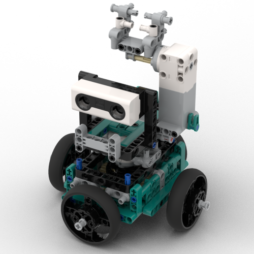

# TrackstormsBot

Face tracking using Raspberry Pi & Lego Mindstorms! The Pi [Build Hat](https://www.raspberrypi.com/products/build-hat/), Pi Camera, and Lego mindstorms motors are combined to create a face tracking robot. It provides a barebones Flask interface for monitoring the bot headlessly. In short, it provides:

- Instructions for a movable Lego robot using Mindstorms motors & sensors.
- Ability to use various face detection algorithms for the robot to follow your face.
- Ability to detect hand gestures.
- Webinterface for monitoring the video feed and detections, allowing the robot to operate headlessly.

## Installation

### Hardware

To replicate this project, the following hardware is required:

- A [Mindstorms Robot Inventor (51515)](https://www.bricklink.com/v2/catalog/catalogitem.page?S=51515-1#T=S&O=%7B%22iconly%22:0%7D) set. This set is all that's needed to build the robot. It used two medium motors and a distance sensor

  _Note: other compatible devices can be found [here](https://www.raspberrypi.com/documentation/accessories/build-hat.html#device-compatibility)._

- A [Raspberry Pi 4B](https://www.raspberrypi.com/products/raspberry-pi-4-model-b/) with 64-bit OS.

  _Note: A Raspberry Pi 3 variant with a 64-bit OS might also work with reduced performance._

- The [Raspberry Pi Build Hat](https://www.raspberrypi.com/products/build-hat/)

- The [Build Hat Power Supply](https://www.raspberrypi.com/products/build-hat-power-supply/) or similar 8V charger. Optionally, a battery pack could be used.

- A Raspberry Pi compatible camera. I used a cheap 5MP option like [this](https://www.az-delivery.de/en/products/raspberrykamerav1-3), but official units should work as well (or even better)

- (Optional) A cooling fan. Due to the heavy processing done on the device, temperatures can get high. A small fan can be places between the build hat and Pi to remedy this.

To get your hardware ready, follow these steps:

- Build your Lego robot! Instructions are available [here](etc/lego_model_v0.2.0.pdf).

- Install the latest [Raspberry Pi 64-bit OS](https://www.raspberrypi.com/software/). If you use a headless device (no monitor connected), don't forget to set your WiFi and SSH settings so you can access the device over the network. [Video](https://www.youtube.com/watch?v=ntaXWS8Lk34).

- Install the Build Hat following the tutorial [here](https://www.raspberrypi.com/documentation/accessories/build-hat.html). Don't forget to enable Serial Port and disable Serial Console for the Hat to function.

- Whilst you're in the settings menu, enable the Camera (or Legacy Camera) under Interface options.

### Software

Install dependencies and python packages:

```bash
./setup.sh
pip install -r requirements.txt
```

## Usage

Run the provided script to launch the webinterface and start the bot:

```bash
python run.py
```

This will launch a webinterface which can be accessed to monitor the camera feed at `http://<pi_ip>:5000`.

_Note: Starting the program the first time after a reboot can take longer due to the Hat's initialization. If something goes wrong the first time, just try again._

### Detectors

Different face detectors can be selected using the `-d` or `--detector` flag:

- `haarcascade`: Face detection using the OpenCV Haar feature-based cascade classifier ([link](https://docs.opencv.org/3.4/db/d28/tutorial_cascade_classifier.html)).

- `yunet`: The OpenCV based YuNet CNN model. More accurate and faster than `haarcascade` ([link](https://opencv.org/opencv-face-detection-cascade-classifier-vs-yunet/)).

- `mediapipe`: A google Mediapipe face detector ([link](https://github.com/google/mediapipe/blob/master/docs/solutions/face_detection.md)).

### Gesture Recognisers

The gesture recogniser is based on the Mediapipe [hand landmark detector](https://github.com/google/mediapipe/blob/master/docs/solutions/hands.md), and a gesture classifier proposed by [Kazuhito00](https://github.com/Kazuhito00/hand-gesture-recognition-using-mediapipe).
